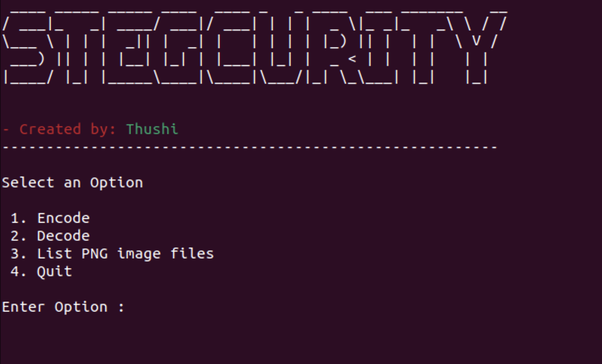

## About Stegcurity 

Stegcurity is a python based stegnography tool designed to hide messages in to the images. It helps people who wish to share a secret within an image.

## Screenshots




## Installation

```
git clone https://gitlab.com/thushi99/isp-stegnography-tool.git
```

## Recommended Python Version:

Stegcurity currently supports **Python 2** and **Python 3**.

* The recommended version for Python 2 is **2.7.x**
* The recommended version for Python 3 is **3.4.x**

## Dependencies:

Sublist3r depends on the `cv2`, `numpy`, `pyfiglet`, `termcolors`, `os`, `base64` and `platform` python modules.

These dependencies can be installed using the requirements file:

- Installation on Windows:
```
pip install -r requirements.txt
```
- Installation on Linux
```
sudo pip install -r requirements.txt
```

Alternatively, each module can be installed independently as shown below.

#### cv2 Module (https://pypi.org/project/opencv-python/)

- Install for Windows:
```
pip install opencv-python
```

- Install using pip on Linux:
```
sudo pip install opencv-python
```

#### numpy Module (https://numpy.org/install/)

- Install for Windows:
```
pip install numpy
```

- Install using pip on Linux:
```
sudo pip install numpy
```

#### termcolor Module (https://pypi.org/project/termcolor/)

- Install for Windows:
```
pip install termcolor
```

- Install using pip on Linux:
```
sudo pip install termcolor
```

#### pyfiglet Module (https://pypi.org/project/pyfiglet/)

- Install for Windows:
```
pip install pyfiglet
```

- Install using pip on Linux:
```
sudo pip install pyfiglet
```

## How to Run
- Windows:
```
python stegcurity.py
```

- Linux:
```
python stegcurity.py
```
or
```
python3 stegcurity.py
```

## Restrictions
* Currently this version support for hiding messages only within `.png` format Images

## Version
**Current Version is 1.0**
